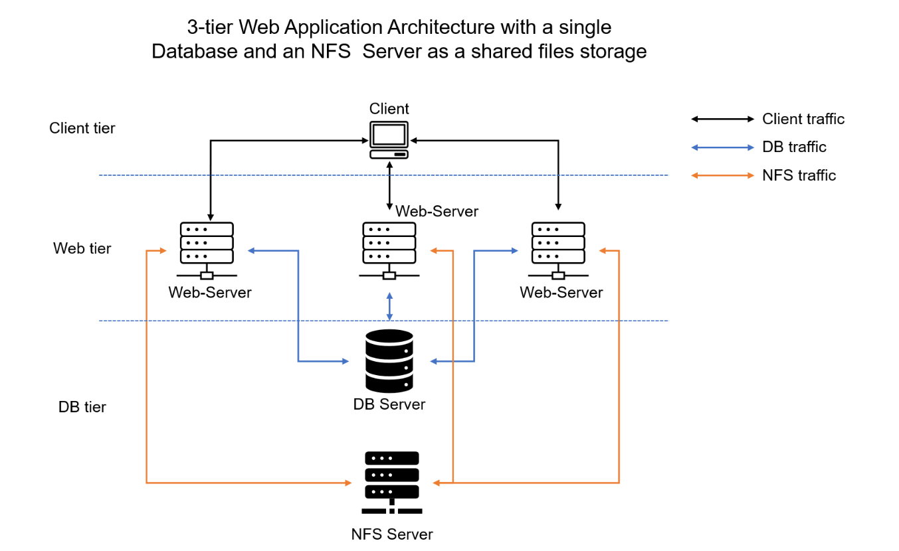

# DEVOPS-TOOLING-WEBSITE-SOLUTION

### Setup and technologies used in Project 7

As a DevOps engineer, I have implemented a tooling website solution which makes access to DevOps tools within the corporate infrastructure easily accessible

I have implemented a solution that consits of the following components in this project.

- Infrastructure AWS
- Webserver Linux: Red Hat Enterprise Linux 8
- Database Server: Ubuntu 20.04 + MySQL
- Storage Server: Red Hat Enterprise Linux 8 + NFS Server
- Programming Language: PHP
- Code Repository: GitHub.

