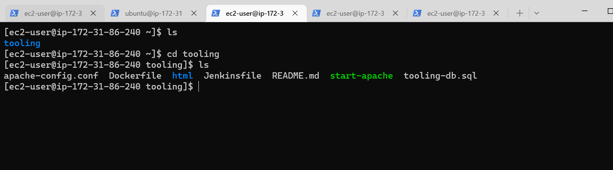
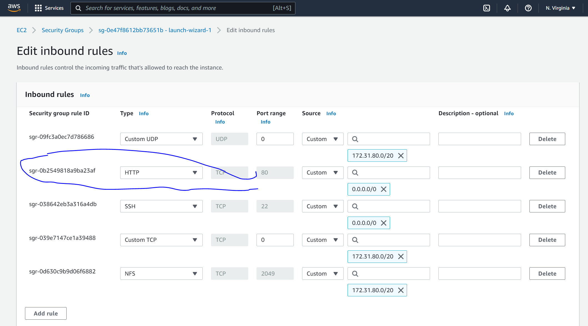

## The prerequisites for this project.
Launch 5 instances in AWS EC2 
- 3 Web servers using RedHat OS
- 1 Database server using Ubuntu OS
- 1 NFS server using RedHat OS
- Create and attach 3 EBS volumes for NFS server 

### Step 1: prepare NFS Server
Launch an instance for NFS server 

Create 3 EBS(Elastic Block Store) volumes with 10G and attach them to nfs server

ssh to nfs server using Windows shell

use lsblk command to inspect what block devices are attached to the server
`lsblk`

Use gdisk utility to create a single partition on each of the 3 disks
`sudo gdisk /dev/xvdf`
`sudo gdisk /dev/xvdg`
`sudo gdisk /dev/xvdh`

Use `lsblk` utility to view the newly configured partition on each of the 3 disks.

Install lvm2 package using `sudo yum install lvm2 -y`

Run `sudo lvmdiskscan` command to check for available partitions

Use pvcreate utility to mark each of 3 disks as physical volumes (PVs) to be used by LVM
`sudo pvcreate /dev/xvdf1`
`sudo pvcreate /dev/xvdg1`
`sudo pvcreate /dev/xvdh1`

Verify that your Physical volume has been created successfully by running `sudo pvs`

Use vgcreate utility to add all 3 PVs to a volume group (VG). Name the VG webdata-vg
`sudo vgcreate webdata-vg /dev/xvdh1 /dev/xvdg1 /dev/xvdf1`

Verify that your VG has been created successfully by running `sudo vgs`

Use lvcreate utility to create 3 logical volumes. apps-lv (Use half of the PV size), and logs-lv Use the remaining space of the PV size. NOTE: apps-lv will be used to store data for the Website while, logs-lv will be used to store data for logs.
`sudo lvcreate -n apps-lv -L 9G webdata-vg`
`sudo lvcreate -n logs-lv -L 9G webdata-vg`
`sudo lvcreate -n opt-lv -L 9G webdata-vg`

Verify that your Logical Volume has been created successfully by running `sudo lvs`

Verify the entire setup
`sudo vgdisplay -v #view complete setup - VG, PV, and LV`
`sudo lsblk`

Use mkfs.xfs to format the logical volumes with xfs filesystem
`sudo mkfs -t xfs /dev/webdata-vg/lv-apps`
`sudo mkfs -t xfs /dev/webdata-vg/lv-logs`
`sudo mkfs -t xfs /dev/webdata-vg/lv-opt`

Create mnt directory for the logical volumes as follow:
`sudo mkdir /mnt/apps`
`sudo mkdir /mnt/logs`
`sudo mkdir /mnt/opt`

Mount points on mnt directory for the logical volumes as follow:
`sudo mount /dev/webdata-vg/apps-lv /mnt/apps`
`sudo mount /dev/webdata-vg/logs-lv /mnt/logs`
`sudo mount /dev/webdata-vg/opt-lv /mnt/opt`

Install NFS server, configure it to start on reboot and make sure it is up and running
`sudo yum -y update`
`sudo yum install nfs-utils -y`
`sudo systemctl start nfs-server.service`
`sudo systemctl enable nfs-server.service`
`sudo systemctl status nfs-server.service`

Export the mounts for webservers’ subnet cidr to connect as clients. To check for subnet cidr – open EC2 details in AWS web console and locate ‘Networking’ tab and open a Subnet link:

Set up permission that will allow our Web servers to read, write and execute files on NFS:
`sudo chown -R nobody: /mnt/apps`
`sudo chown -R nobody: /mnt/logs`
`sudo chown -R nobody: /mnt/opt`

`sudo chmod -R 777 /mnt/apps`
`sudo chmod -R 777 /mnt/logs`
`sudo chmod -R 777 /mnt/opt`

Restart the NFS server
`sudo systemctl restart nfs-server.service`

Check the NFS server
`sudo systemctl status nfs-server.service`

Configure access to NFS for clients within the same subnet
`sudo vi /etc/exports`
Then paste the following 
`/mnt/apps 172.31.80.0/20(rw,sync,no_all_squash,no_root_squash)`
`/mnt/logs 172.31.80.0/20(rw,sync,no_all_squash,no_root_squash)`
`/mnt/opt 172.31.80.0/20(rw,sync,no_all_squash,no_root_squash)`

To see the exportfs
`sudo exportfs -arv`

Check which port is used by NFS and open it using Security Groups
`rpcinfo -p | grep nfs`

## Step 2: Configure the database server

Launch an instance for database server using ubuntu

ssh to database server using Windows shell

Install MySQL server
`sudo apt update`
`sudo apt install mysql-server -y`
Check status
`sudo systemctl status mysql`

Create a database and name it tooling
`sudo mysql`

`create database tooling;`

`Create a database user and name it webaccess`

 Grant permission to webaccess user on tooling database to do anything only from the webservers subnet cidr

`grant all privileges on tooling.* to 'webaccess'@'172.31.80.0/20';`

`flush privileges;`

`show databases;`

`use tooling;`

`ext;`

Check mysql status
`sudo systemctl status mysql`

Change the bind address
`sudo vi /etc/mysql/mysql.conf.d/mysqld.cnf`

bind-address   = 0.0.0.0

mysqlx-bind-address   = 0.0.0.0

Restart mysql
`sudo systemctl restart mysql`
Check staus
`sudo systemctl status mysql`

## Step 3: Prepare the webservers
1. Launch an instance for Web server

ssh to web server using Windows shell

2. Install NFS client
`sudo yum install nfs-utils nfs4-acl-tools -y`

3. Mount /var/www/ and target the NFS server’s export for apps
`sudo mkdir /var/www`
`sudo mount -t nfs -o rw,nosuid`
`172.31.85.207:/mnt/apps /var/www`

4. Verify that NFS was mounted successfully by running `df -h`. 

Make sure that the changes will persist on Web Server after reboot:
`sudo vi /etc/fstab`

add following line
172.31.85.207:/mnt/apps /var/www nfs defaults 0 0

5. Install Remi’s repository, Apache and PHP
`sudo yum install httpd -y`

`sudo dnf install https://dl.fedoraproject.org/pub/epel/epel-release-latest-8.noarch.rpm`

`sudo dnf install dnf-utils http://rpms.remirepo.net/enterprise/remi-release-8.rpm`

`sudo dnf module reset php`

`sudo dnf module enable php:remi-7.4`

`sudo dnf install php php-opcache php-gd php-curl php-mysqlnd`

`sudo systemctl start php-fpm`

`sudo systemctl enable php-fpm`

`sudo setsebool -P httpd_execmem 1`

Repeat steps 1-5 for the other 2 Web Servers.

6. Verify that Apache files and directories are available on the Web Server in /var/www and also on the NFS server in /mnt/apps. 
`ls /var/www`

7. Locate the log folder for Apache on the Web Server and mount it to NFS server’s export for logs

`sudo mount -t nfs -o rw,nosuid 172.31.85.207:/mnt/logs /var/log/httpd`

Locate the log folder for Apache on the Web Server and mount it to NFS server’s export for logs. Repeat step №4 to make sure the mount point will persist after reboot.
`sudo vi /etc/fstab`
add following line

`172.31.85.207:/mnt/apps /var/www nfs defaults 0 0`
`172.31.85.207:/mnt/logs /var/log/httpd nfs defaults 0 0`

8. Fork the tooling source code from Darey.io Github Account to your Github account
Install git on the web server:
`sudo yum install git`

click on code and make sure it's on https and copy the link
git clone (the link from github)

ls (to see the tooling file)
cd tooling
ls to see all files under tooling 

Deploy the tooling website’s code to the Webserver.
check for the html file by running this command ls /var/www
`sudo cp -R html/. /var/www/html`
`ls /var/www/html`
`ls html`

Open port http 80 on the web server and allow to anywhere

The web server ip address is not rachable so I will check the permission of /var/www/html folder and also disable SELinux sudo setenforce 0

To make this change permanent – I opened following config file sudo vi /etc/sysconfig/selinux and set SELINUX=disabledthen

Restart the apache httpd 
`sudo systemctl restart httpd`
`sudo systemctl status httpd`

Update the website’s configuration to connect to the database. 
`sudo vi  /var/www/html/functions.php file`
change the following under connect to database 
$db = mysqli_connect('172.31.81.144', 'webaccess', 'password', 'tooling');

Add inbound rule for database server
Mysql/aurora

Apply tooling-db.sql script to database using this command
Install mysql using `sudo yum install mysql` then run the following command
`mysql -h 172.31.81.144 -u webaccess -p tooling < tooling-db.sql`

Create in MySQL a new admin user with username: myuser and password: password:

Open the website in your browser http://54.197.70.183/index.php and make sure you can login into the websute with myuser user.

